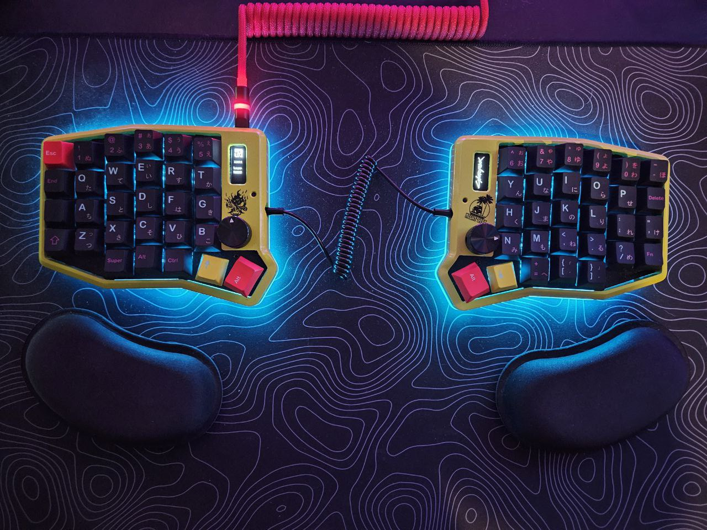
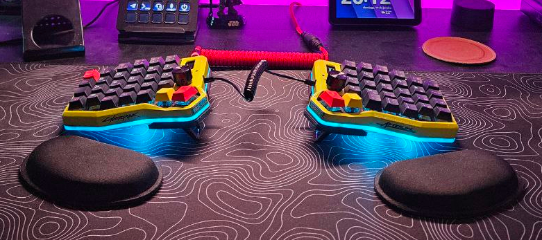
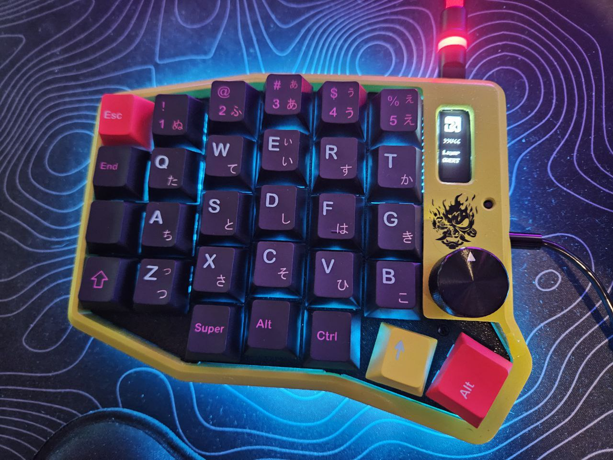
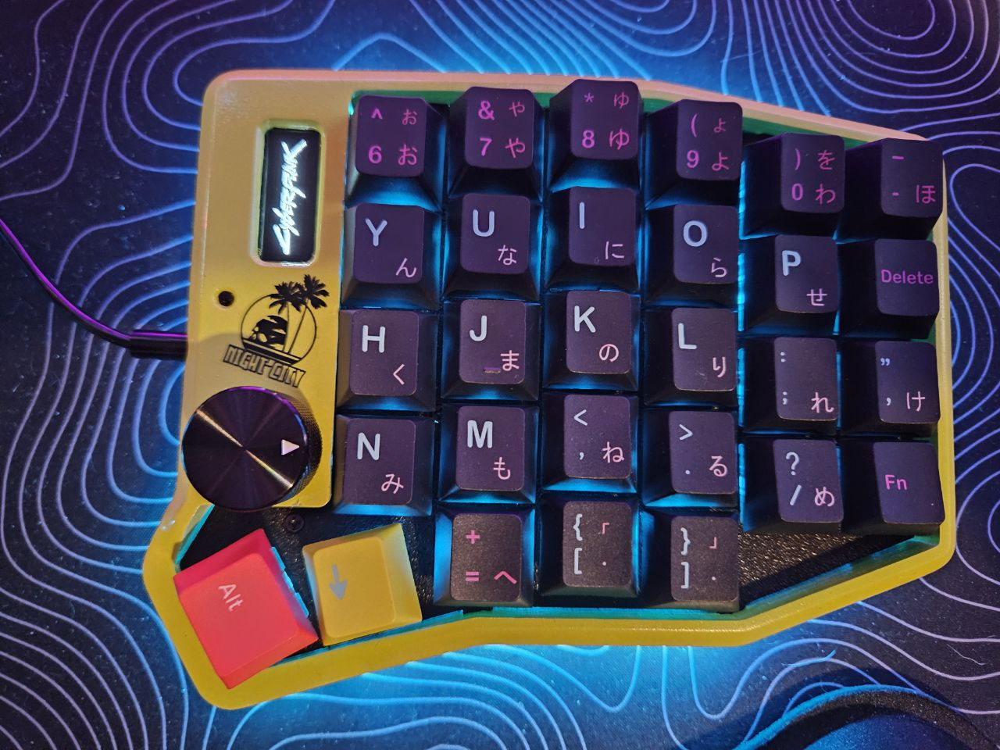
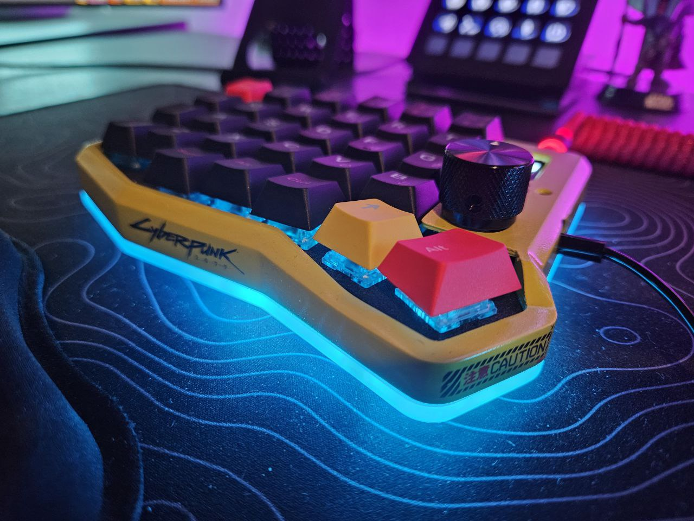

# Cyberpunk KB
This project was created to provide the necessary files and information to build a split Sofle V2 RGB keyboard, fully customized with the Cyberpunk 2077 theme.

## Expectations
Below is a GIF showcasing a 3D representation of how the keyboard should look once the project is completed.

## Files
The STL files available in the print_3d directory were designed for the keyboard case construction. They can be downloaded and used with a 3D printer. In my case, I used the Ender 3 V3 KE model for printing.

## Reality
The final result was achieved using [STL](3d_print/) files that I created to 3D print the case in PLA plastic. These files are available in my repository for anyone interested. After printing, the case underwent a sanding process and was painted with acrylic paint applied using an airbrush. Additionally, I added some decals that I designed myself and applied a layer of glossy varnish over the entire case for a polished finish.

For the base of the case, I used a transparent acrylic plate that, after being laser-cut, was sanded to achieve a matte finish, enhancing the diffusion of the underglow LED lights.

Furthermore, I attached four 10x4mm neodymium magnets to the acrylic plate to enable the use of an optional **tenting** solution, making it easier to remove and adjust when needed.

Initially, I printed two knobs for the EC11 encoders, but the result did not meet my expectations. I decided to purchase a metal knob instead, which provided a more polished and aesthetically pleasing result.

For the keycaps, I chose to create a custom set on  [diykeycap.com](https://diykeycap.com/products/custom-keycap-1734-1?ar-prs=eyJtZXNzYWdlSWQiOjAsImNvbnRlbnQiOiIiLCJzdGFycyI6NSwiY3VzdG9tZXJOYW1lIjoiRmVsaXBlIFBhcmFpem8iLCJjdXN0b21lckVtYWlsIjoiZmVsaXBlcGFyYWl6b0BnbWFpbC5jb20ifQ==), aiming to align the design with the Cyberpunk 2077 theme.

Alright, I believe I’ve met my expectations.
